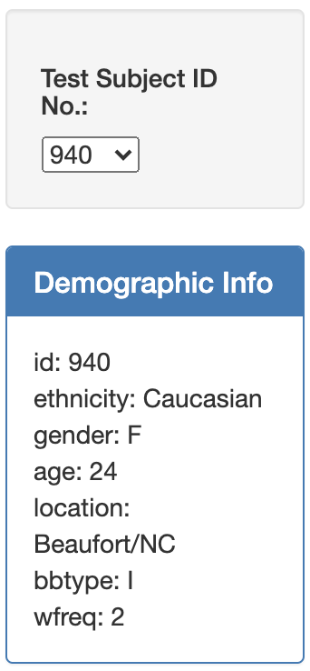
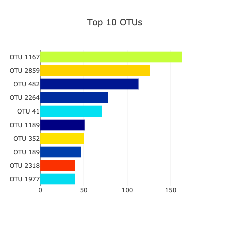
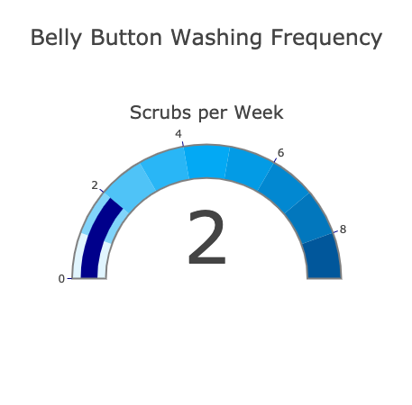
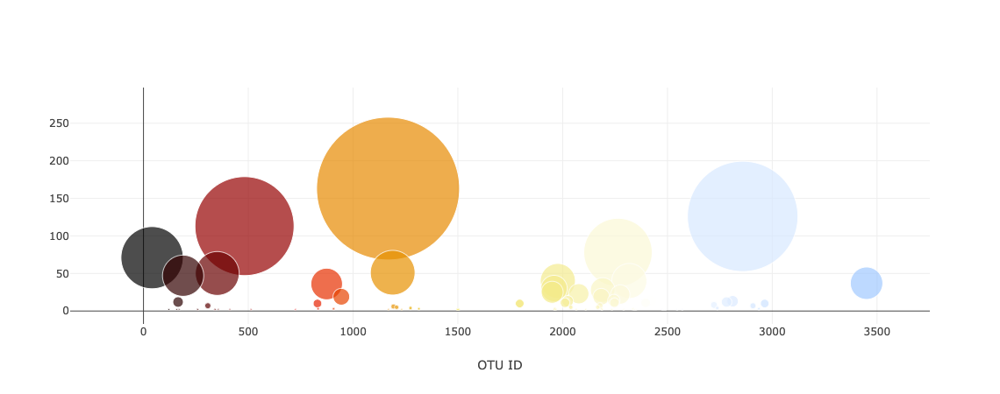

# plotly-challenge - Belly Button Biodiversity

>  Build an interactive dashboard to explore the Belly Button Biodiversity dataset, which catalogs the microbes that colonize human navels.

## Table of contents
* [Deployed App](#Deployed-App)
* [Tasks](#Tasks)
* [Contact](#Contact)

## Deployed App

https://deepavadakan.github.io/plotly-challenge/

## Tasks

1.  Populate a dropdown menu with all of the Sample ID's. When an option is selected, this will update all of the charts.

2.  Display sample metadata, i.e., an individual's demographic information

3.  Horizontal bar chart with a dropdown menu to display the top 10 OTUs found in that individual.

4.  Gauge Chart to plot the weekly washing frequency of the individual.

5.  Bubble chart that displays each sample

6. Deploy page to GitHub pages.

https://deepavadakan.github.io/plotly-challenge/

## Contact
Created by [@deepavadakan](https://github.com/)